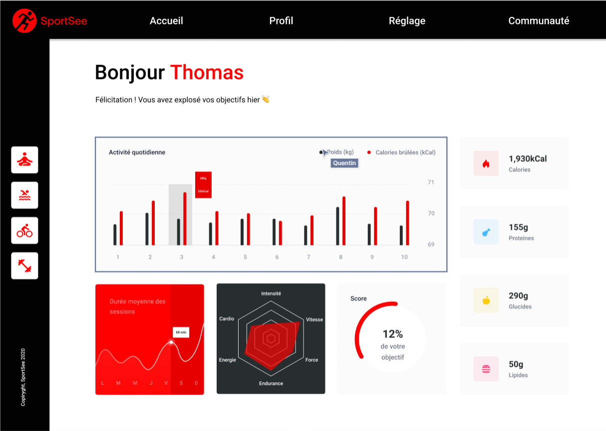

# SportSee - OCR

Project de formation chez OpenClassRoom.

# Langage solicité

- SASS
- JS
- REACT || NEXT
- TYPESCRIPT
- TAILWIND

# Objectif

- Assurer la qualité des données d'une application
- Développer des éléments graphiques avancés à l'aide de bibliothèques JavaScript
- Interagir avec un service Web

# Maquette

[Canevas](https://www.figma.com/file/BMomGVZqLZb811mDMShpLu/UI-design-Sportify-FR?type=design&node-id=0-1&t=nzYOKmlpe47EtT50-0)

# Visiter

[Voir le Rendu](https://nerion-1337.github.io/SportSee-OCR/)

# Aperçu

